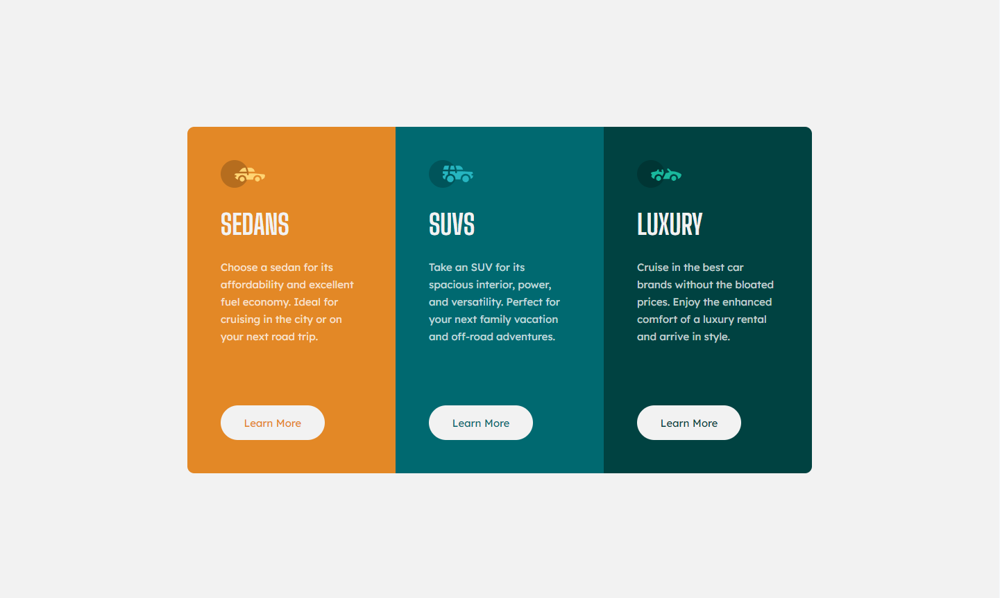

# Frontend Mentor - 3-column preview card component solution

This is a solution to the [3-column preview card component challenge on Frontend Mentor](https://www.frontendmentor.io/challenges/3column-preview-card-component-pH92eAR2-). Frontend Mentor challenges help you improve your coding skills by building realistic projects. 

## Table of contents

- [Overview](#overview)
  - [The challenge](#the-challenge)
  - [Screenshot](#screenshot)
  - [Links](#links)
- [My process](#my-process)
  - [Built with](#built-with)
  - [What I learned](#what-i-learned)
- [Author](#author)
- [Acknowledgments](#acknowledgments)

## Overview

### The challenge

Users should be able to:

- View the optimal layout depending on their device's screen size
- See hover states for interactive elements

### Screenshot

### Links

- Live Site URL: [3 Column Preview Component](https://rkendall300.github.io/3-column-preview)

## My process

### Built with

- Semantic HTML5 markup
- CSS custom properties
- Flexbox
- Mobile-first workflow

### What I learned

For this project I had a little bit of a hard time getting everything to stay inside the card, as the padding I added was pushing outside of the display instead of on the inside. I dealt with it by just changing the width and height dimensions to include the padding and margins so everything would fit inside, but I'm not too comfortable with how it worked out. I expect something like this to happen again in a later project, so hopefully by then I'll have something more robust figured out. Also, having to add in overflow: hidden onto the card itself so the sections wouldn't go over the border-radius was an interesting workaround. 

## Author

- Frontend Mentor - [@rkendall300](https://www.frontendmentor.io/profile/rkendall300)

## Acknowledgments

I'd like to thank my parents on this project for encouraging me to continue doing frontend development, and for supporting me through this career change. I wouldn't be able to do this many projects or stay focused without their help. 
